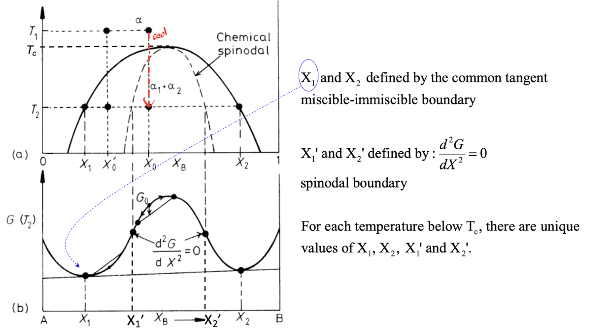
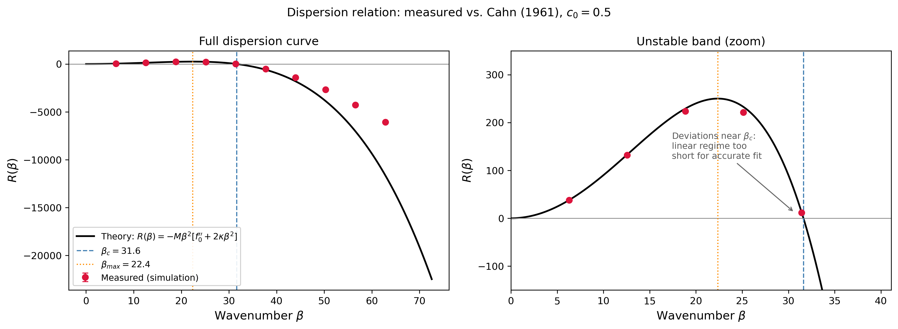
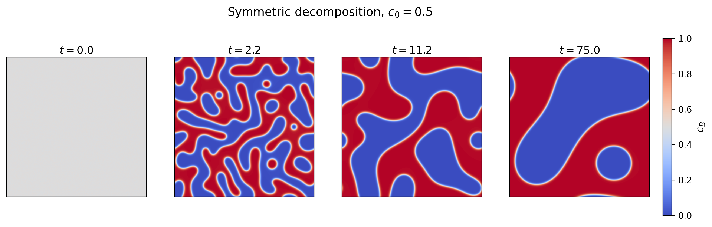
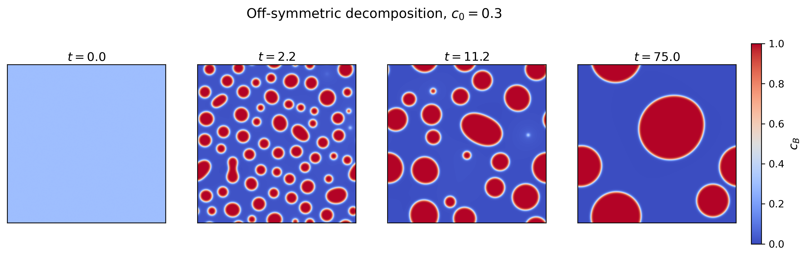
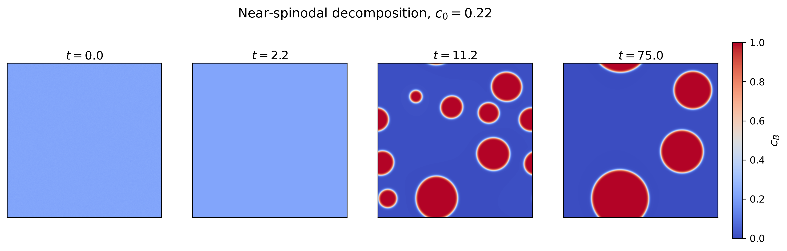
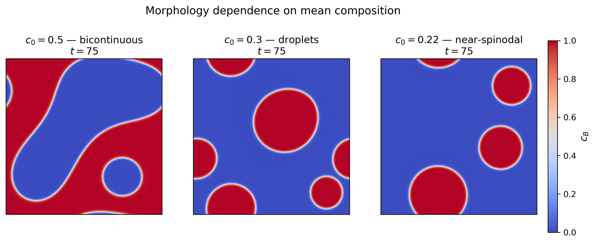
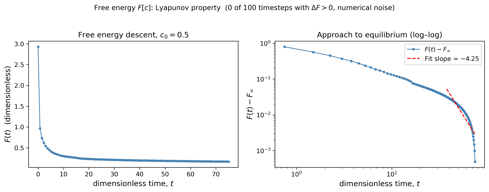

# Spinodal Decomposition from a Phase-Field Perspective

**Term Paper, MTLE-6060 Advanced Kinetics**

**Yash Kokane**

**7 May 2026**

---

## Primary papers reviewed:
Cahn, J. W., & Hilliard, J. E. (1958). Free Energy of a Nonuniform System. I. Interfacial Free Energy. *Journal of Chemical Physics*, **28**, 258. doi:10.1063/1.1744102

Cahn, J. W. (1961). On Spinodal Decomposition. *Acta Metallurgica*, **9**, 795-801. doi:10.1016/0001-6160(61)90182-1

## 1. Motivation

In the Advanced Kinetics course, we discuss Spinodal Decomposition (Lecture 16) \cite{ShiLecture16}, where we discuss the standard framework for identifying the spinodal region of a binary phase diagram (figure below). 

(Figure: Slide 6, Lecture 16 \cite{ShiLecture16} - defining the spinodal region on a binary phase diagram)
Beginning with the regular-solution Gibbs free energy
$$G = X_A G_A + X_B G_B + \Omega X_A X_B + RT(X_A \ln X_A + X_B \ln X_B), \qquad \Omega = N_a z\left[\varepsilon_{AB} - \frac{1}{2}(\varepsilon_{AA} + \varepsilon_{BB})\right]$$

In the figure, we see two stability boundaries: the binodal $X_1$ and $X_2$, defined by the common-tangent construction, and the chemical spinodal $X_1'$ and $X_2'$, defined by $\partial^2 G/\partial c^2 = 0$. Inside the binodal, the system is metastable and decomposes by nucleation and growth; inside the chemical spinodal, the system is unstable to infinitesimal compositional fluctuations and decomposes by uphill diffusion. 

What this framework cannot quantify, however, is the *length scale* of the resulting morphology. The bulk thermodynamic functional $G(c)$ describes only homogeneous compositions; it has no mechanism to determine the thickness of an interface, the rate at which composition fluctuations grow, or the existence of a preferred wavelength. These quantities require an additional term in the free-energy functional that penalizes spatial variation: the gradient energy $\kappa(\nabla c)^2$.

Several specific gaps in the lecture-level picture motivate this study:

- **The "long enough wavelength" criterion** for instability is asserted but not quantified. Why are short-wavelength fluctuations suppressed despite being thermodynamically favored?
- **The "regularity in the second phase"** is given as a feature of spinodal decomposition. What sets the spacing? Why is it the *same* across the sample?
- **The chemical spinodal** is presented as the limit of metastability. In solids, this is incorrect: elastic coherency strains shift the actual instability boundary inward, sometimes by hundreds of degrees.
- **Approach to the critical point.** What happens to the morphology and dynamics as $T \to T_c$? Does the system show critical slowing down?

The two papers reviewed here resolve each of these questions and form the basis of nearly all modern phase-field methodology.

---

### On choosing two papers for the review.

A natural question is whether the kinetic theory of spinodal decomposition, introduced by Cahn in his 1961 paper \cite{Cahn1961} can be reviewed without reference to the earlier Interfacial Free Energy paper \cite{CahnHilliard1958}. The answer is no, for a structural reason: the 1961 paper does not derive its free-energy functional from scratch. It assumes the form

$$F[c] = \int \left[f'(c) + \kappa(\nabla c)^2\right] dV \tag{1}$$

established three years earlier by Cahn and Hilliard \cite{CahnHilliard1958}, and constructs kinetics by treating it as the driving potential for a conservation law. Without the 1958 derivation, the gradient term $\kappa(\nabla c)^2$ has no microscopic basis, no estimate from atomic-scale parameters, and no justification for the symmetry constraints — such as scalar isotropy on cubic lattices — that allow it to be written with a single coefficient.

The 1961 dispersion relation that selects the fastest-growing wavelength, $\lambda_{\max} = \sqrt{2}\,\lambda_c$, contains $\kappa$ explicitly, and the physical interpretation of $\lambda_{\max}$ — that it is set by the competition between bulk thermodynamic gain and gradient-energy cost — is meaningful only when $\kappa$ has a physical interpretation.

The 1958 paper, especially, doesn't talk at all about spinodal decomposition. Its subject is the equilibrium interface between two coexisting phases, not the kinetics of phase separation. The closest reference is a single sentence in §2c noting that $\kappa$ must be everywhere positive, "as otherwise [...] the homogeneous phase would be unstable with respect to periodic composition fluctuations." 

Together, the two papers form a complete theory of inhomogeneous binary systems: the first provides the equilibrium functional and a microscopic estimate of $\kappa$; the second provides the kinetic equation and the linear-stability analysis. An independent derivation of the same solid-solution model, arriving at essentially equivalent continuum equations by a lattice-based argument, was published concurrently by Hillert \cite{Hillert1961}.

---

## 3. Impact

Cahn and Hilliard \cite{CahnHilliard1958} and Cahn \cite{Cahn1961} are foundational across multiple fields of condensed-matter physics, materials science, and beyond.

The phase-field method for microstructure simulation traces directly to the inhomogeneous free-energy functional $F[c]$ established in 1958. Modern phase-field tools — MOOSE (Idaho National Laboratory), PRISMS-PF (University of Michigan), FiPy (NIST), and dozens of academic in-house codes — all solve direct descendants of the equations introduced in these two papers. The Cahn-Hilliard equation has become the canonical model for conserved-order-parameter dynamics.

Beyond materials science, Cahn-Hilliard dynamics is now standard machinery in the description of liquid-liquid phase separation in cell biology, polymer blend morphology, and instability problems in colloidal and soft-matter systems.

---

## 4. Theoretical background

### 4.1 The non-uniform free-energy functional (Cahn & Hilliard 1958, §2a)

The central derivation of Cahn and Hilliard \cite{CahnHilliard1958} appears in §2a of that paper. Consider a binary A-B alloy with local mole fraction $c(\mathbf{r})$ of component B. The local free energy per molecule, $f$, is taken to depend on $c$ and its spatial derivatives. To lowest non-trivial order in the gradient, this dependence is captured by a Taylor expansion:

$$f(c, \nabla c, \nabla^2 c, \ldots) = f_0(c) + \sum_i L_i \frac{\partial c}{\partial x_i} + \sum_{ij} \kappa_{ij}^{(1)} \frac{\partial^2 c}{\partial x_i \partial x_j} + \tfrac{1}{2}\sum_{ij} \kappa_{ij}^{(2)} \frac{\partial c}{\partial x_i}\frac{\partial c}{\partial x_j} + \cdots \tag{2}$$

where $f_0(c)$ is the homogeneous-system free energy and the coefficients $L_i$, $\kappa_{ij}^{(1)}$, $\kappa_{ij}^{(2)}$ are tensors. Here $x_i$ and $x_j$ denote Cartesian spatial coordinates, with indices ranging over $\{1, 2, 3\}$. The vector $L_i$ is a polar coefficient that couples the free energy linearly to the first spatial derivative of composition; in the most general crystal it has three independent components. The second-rank tensors $\kappa_{ij}^{(1)}$ and $\kappa_{ij}^{(2)}$ couple the free energy to, respectively, the second-order compositional derivatives $\partial^2 c/\partial x_i \partial x_j$ and the bilinear products $(\partial c/\partial x_i)(\partial c/\partial x_j)$; each may in principle have up to six independent components in an anisotropic medium.

In a cubic crystal or isotropic medium, three symmetry constraints reduce these tensors significantly. Reflection invariance ($x_i \to -x_i$) requires $L_i = 0$, since a polar contribution would distinguish positive from negative gradients, which is unphysical for a scalar field. Four-fold rotation invariance forces $\kappa_{ij}^{(1)}$ and $\kappa_{ij}^{(2)}$ to be proportional to the identity:

$$\kappa_{ij}^{(1)} = \kappa_1\, \delta_{ij}, \qquad \kappa_{ij}^{(2)} = \kappa_2\, \delta_{ij}.$$

The remaining expansion is

$$f = f_0(c) + \kappa_1 \nabla^2 c + \kappa_2 (\nabla c)^2 + \cdots \tag{3}$$

To convert this local expression into a usable functional, integrate over a volume $V$. The key step is application of the divergence theorem to the $\kappa_1 \nabla^2 c$ term:

$$\int_V \kappa_1 \nabla^2 c \, dV = -\int_V \frac{d\kappa_1}{dc}(\nabla c)^2 \, dV + \oint_S \kappa_1 \nabla c \cdot \hat{\mathbf{n}}\, dS. \tag{4}$$

The surface integral vanishes if the integration domain is chosen such that $\nabla c \cdot \hat{\mathbf{n}} = 0$ on the boundary, an appropriate condition for studying bulk effects. The remaining volume integral has the form $(\nabla c)^2$, and it absorbs into the $\kappa_2$ coefficient. Defining the effective gradient-energy coefficient

$$\kappa \equiv -\frac{d\kappa_1}{dc} + \kappa_2,$$

the functional reduces to the central result of the 1958 paper:

$$\boxed{\,F = N_V \int_V \left[f_0(c) + \kappa(\nabla c)^2\right] dV\,} \tag{5}$$

#### Discussion of variables

- $F$: total Helmholtz free energy of the system; an extensive quantity with units of energy. The choice of Helmholtz rather than Gibbs reflects the fact that solids carry coherency stresses at fixed lattice geometry, so volume rather than pressure is the natural constraint.
- $N_V$: number density of molecules, with units of inverse volume; a unit-conversion factor between per-molecule and per-volume free energies.
- $V$: the spatial domain of integration.
- $c(\mathbf{r})$: the composition field — the unknown to be determined by minimization. For a binary A-B alloy, $c$ is the local mole fraction of B.
- $f_0(c)$: the homogeneous free energy per molecule, dependent only on local composition. Its shape encodes all bulk thermodynamics; a double-well form gives phase separation, a single-well form gives a stable solid solution.
- $\nabla c$: composition gradient; a vector field.
- $(\nabla c)^2 \equiv |\nabla c|^2$: the squared magnitude of the gradient; a non-negative scalar. The fact that only the squared gradient appears (and not, say, $\nabla c$ linearly) is enforced by the symmetry constraints noted above.
- $\kappa$: the gradient-energy coefficient, with units of energy times area per molecule. In the regular-solution model, $\kappa$ can be computed from microscopic pair interactions (Section 4.2 below).

#### Physical interpretation

Equation (5) decomposes the total free energy into two contributions integrated over space. The first, $f_0(c)$, is the free energy that the system would have if it were locally homogeneous at composition $c$. The second, $\kappa(\nabla c)^2$, penalizes spatial variation. The two terms compete:

- Inside a miscibility gap, $f_0(c)$ for any composition between $c_\alpha$ and $c_\beta$ exceeds the free energy of the equilibrium two-phase mixture (the common tangent). The bulk term therefore favors a sharp interface.
- The gradient term grows as the inverse square of the interface width and therefore favors gradual variation in concentration.

Equilibrium is the compromise that minimizes $F[c]$ subject to the boundary conditions. Application of the Euler-Lagrange equation to the integrand of (5), together with the boundary conditions $c \to c_\alpha$ as $x \to -\infty$ and $c \to c_\beta$ as $x \to +\infty$, yields a first integral expressing equipartition between the two costs at every point in the equilibrium profile:

$$\Delta f(c) = \kappa\left(\frac{dc}{dx}\right)^2 \tag{6}$$

where $\Delta f(c) = f_0(c) - [c\mu_B^{(e)} + (1-c)\mu_A^{(e)}]$ is the bulk free-energy excess of composition $c$ relative to the equilibrium two-phase mixture. The interfacial free energy follows as

$$\sigma = 2 N_V \int_{c_\alpha}^{c_\beta} \sqrt{\kappa\, \Delta f(c)}\, dc, \tag{7}$$

and near the critical point, both $\sigma$ and the interface thickness $\ell$ exhibit mean-field critical scaling:

$$\sigma \propto (T_c - T)^{3/2}, \qquad \ell \propto (T_c - T)^{-1/2}. \tag{8}$$

The interface broadens and the surface tension vanishes as the two phases become identical at $T_c$, as expected for a continuous phase transition. The same length scale $\ell$ that sets the equilibrium interface width will reappear in Section 4.3 as the inverse of the critical wavenumber $\beta_c$ in the kinetic problem. The two are manifestations of the same competition between $\kappa$ and a bulk-thermodynamic energy scale.

The key insight: *the total free energy of a system with non-uniform composition equals the bulk free energy plus a penalty for spatial variation, summed over the volume. The whole rest of phase-field theory is downstream of this idea.*

### 4.2 Understanding $\kappa$ (Cahn & Hilliard 1958)

Equation (5) leaves $\kappa$ as a phenomenological parameter. Section 3a of Cahn and Hilliard \cite{CahnHilliard1958} addresses the question of whether $\kappa$ can be computed from first principles, doing so explicitly for the regular-solution model.

Consider a B atom at a lattice site $\mathbf{R}$ surrounded by neighbors at sites $\mathbf{S} = \mathbf{R} + \mathbf{r}$ within coordination shells of radius $r_n$. The probability that a B atom at $\mathbf{R}$ has an A neighbor at $\mathbf{S}$ is $C(\mathbf{R})[1 - C(\mathbf{S})]$, with $C$ the local mole fraction of B. To capture the spatial variation of composition, expand $C(\mathbf{S})$ about $\mathbf{R}$:

$$C(\mathbf{S}) = C(\mathbf{R}) + (\mathbf{r}\cdot\nabla)C(\mathbf{R}) + \tfrac{1}{2}(\mathbf{r}\cdot\nabla)^2 C(\mathbf{R}) + \cdots \tag{9}$$

Summing over neighbors in the $n$-th coordination shell, cubic-lattice symmetry annihilates the odd and mixed-derivative terms upon summation. The surviving terms give the total energy per B atom as

$$u(\mathbf{R}) = \omega\, c(1-c) - \tfrac{1}{2}\,\omega\, \lambda^2\, c\, \nabla^2 c \tag{10}$$

where $\omega$ is the regular-solution interaction parameter,

$$\omega = \sum_n Z_n \nu_n, \qquad \nu_n = \varepsilon_{AB}^{(n)} - \frac{1}{2}(\varepsilon_{AA}^{(n)} + \varepsilon_{BB}^{(n)}),$$

with $Z_n$ the coordination number of the $n$-th shell and $\nu_n$ the bond-mismatch energy at shell radius $r_n$. The interaction range $\lambda$ is

$$\lambda^2 \equiv \frac{\sum_n Z_n r_n^2 \nu_n}{3 \sum_n Z_n \nu_n}, \tag{11}$$

a root-mean-square range of the pair interaction weighted by bond mismatch. Note that this is the same $\omega$ as appears in the lecture's $\Omega = N_a \omega$ (with the lecture using per-mole rather than per-atom units); the regular-solution model used to derive the *bulk* miscibility gap is precisely the same model used here to derive the *gradient* coefficient.

The configurational entropy of the regular solution involves no gradient terms (it depends only on the local composition $c$ and is therefore identical to the homogeneous-solution entropy). Combining with the enthalpic gradient term in (10) and applying the divergence-theorem manipulation from Section 4.1 yields the result

$$\boxed{\,\kappa_R = \tfrac{1}{2}\, \omega\, \lambda^2\,} \tag{12}$$

This is the central result that justifies $\kappa$ as a physically meaningful quantity rather than a fitting parameter. In the regular-solution limit, **$\kappa$ is the bond-mismatch energy times the squared interaction range**.

Two observations on the value of $\lambda$ are worth making:

For nearest-neighbor interactions only, $\lambda = r_0 / \sqrt{3}$, where $r_0$ is the interatomic spacing. For a Lennard-Jones 6-12 potential with the simplest radial distribution function ($\rho = 1$ for $r > r_0$, $\rho = 0$ otherwise), $\lambda = \sqrt{11/7}\, r_0 \approx 1.25\, r_0$. Cahn and Hilliard \cite{CahnHilliard1958} explicitly note that "$\lambda$ is very sensitive to the exact nature of the long-range interactions," and this sensitivity is one reason $\kappa$ values quoted in the modern literature for the same alloy can vary by factors of two or more.

For Fe-Cr at 700 K, taking $\omega \approx 2 k_B T_c$ with $T_c \approx 950$ K, and $\lambda \approx a_0/\sqrt{3} \approx 1.7$ Å for BCC Fe, gives $\kappa \approx 4 \times 10^{-40}$ J·m²/atom; multiplied by $N_V \approx 8.5 \times 10^{28}$ m⁻³ this yields an effective gradient stiffness of $\sim 3 \times 10^{-11}$ J/m, consistent with values quoted in the modern Fe-Cr phase-field literature.

### 4.3 Linear stability and the spinodal kinetics (Cahn 1961)

The 1961 paper \cite{Cahn1961} takes the equilibrium functional (5) and uses it to test the stability of a homogeneous solution against infinitesimal compositional fluctuations. Consider a sinusoidal perturbation in the $x$ direction in the vicinity of a homogeneous solution $c_0$: 

$$c(\mathbf{r}) = c_0 + A \cos(\beta x) \tag{13}$$

with small amplitude $A$ and wavenumber $\beta$. Substituting (13) into (5) and computing the free-energy difference between the perturbed and homogeneous states — Taylor-expanding $f_0(c)$ about $c_0$ to second order, computing $(\nabla c)^2 = A^2 \beta^2 \sin^2(\beta x)$, and averaging over the spatial period (so that $\langle \cos^2 \rangle = \langle \sin^2 \rangle = 1/2$ and $\langle \cos \rangle = 0$) — yields

$$\frac{\Delta F}{V} = \frac{A^2}{4}\left[\frac{\partial^2 f_0}{\partial c^2} + 2\kappa \beta^2\right]. \tag{14}$$

The bracket determines stability. Three regimes arise:

1. **Outside the chemical spinodal** ($\partial^2 f_0/\partial c^2 > 0$): both terms positive, bracket positive for all $\beta$. The homogeneous solution is locally stable to all infinitesimal fluctuations. Phase separation requires nucleation of a finite-amplitude fluctuation.

2. **Inside the chemical spinodal** ($\partial^2 f_0/\partial c^2 < 0$): bulk term negative, gradient term positive and growing as $\beta^2$. The bracket is negative for sufficiently small $\beta$. Specifically, the homogeneous state is unstable to fluctuations of wavelength longer than

$$\lambda_c = \frac{2\pi}{\beta_c} = \sqrt{\frac{-8\pi^2 \kappa}{\partial^2 f_0/\partial c^2}}, \tag{15}$$

and stable to fluctuations of shorter wavelength. The gradient term acts as an ultraviolet regulator on the spinodal instability.

3. **At the spinodal limit** ($\partial^2 f_0/\partial c^2 \to 0^-$): $\lambda_c \to \infty$. The unstable band shrinks to a single point at infinite wavelength.

The physical content of (14) is the competition between two scaling forms. Bulk thermodynamic gain inside the spinodal is wavelength-independent, governed by $\partial^2 f_0/\partial c^2$ alone. Gradient cost grows as $\beta^2$. Long wavelengths face cheap gradient costs and proceed; short wavelengths are suppressed by gradient stiffness. The critical wavelength $\lambda_c$ is the boundary at which the two costs balance, and it is the shortest perturbation wavelength at which the system is thermodynamically permitted to phase-separate.

#### Coherent vs chemical spinodal

The chemical spinodal is what we have been referring to as "the spinodal." The coherent spinodal is the corrected stability boundary that accounts for elastic strain. In a solid, the chemical spinodal ($\partial^2 G/\partial c^2 = 0$) is *not* the actual instability boundary. The real boundary — where the homogeneous solution actually starts to spontaneously decompose — is shifted to lower temperatures by an amount that depends on **how much the lattice parameter changes with composition**. 

Different atoms have different sizes. In a Cu-Ni alloy, Cu atoms are slightly bigger than Ni atoms, so a Cu-rich region wants a slightly bigger lattice parameter than a Ni-rich region. In a Au-Ni alloy, Au atoms are much bigger than Ni atoms (Au is 14% larger by metallic radius), so a Au-rich region wants a much bigger lattice parameter than a Ni-rich region.
Quantitatively, this is Vegard's law: the lattice parameter varies linearly with composition,

$$a(c) = a_0\bigl[1 + \eta(c - c_0)\bigr]$$

For Au-Ni: Au is 1.44 Å, Ni is 1.24 Å — a 16% size mismatch. So $\eta \sim 0.15$. The lattice cares enormously about composition.
Now imagine you're in a solid Au-Ni alloy and you start to phase-separate spinodally. A Au-rich region forms next to a Ni-rich region. Each region "wants" to be at its own preferred lattice parameter — the Au-rich region wants to be larger, the Ni-rich region wants to be smaller.
But they can't. They're bonded together coherently — the lattice planes are continuous across the interface. So both regions get stuck at some compromise lattice parameter, with the Au-rich region under compression (smaller than it wants) and the Ni-rich region under tension (larger than it wants). This costs elastic strain energy. This penalty opposes phase separation — it's an extra free-energy cost the system has to pay to decompose. It effectively makes the homogeneous solution more stable than it would be in a fluid, where atoms could just relax freely.

In a solid, composition fluctuations couple to elastic strain via the lattice expansion $\eta = \frac{1}{3}\partial \ln V/\partial c$ (the Vegard-law slope). Cahn \cite{Cahn1961} §2b shows that for an isotropic solid free of defects, the elastic energy of an arbitrary composition fluctuation is

$$\frac{E_{\text{el}}}{V} = \frac{\eta^2 E}{1-\nu}\, (c-c_0)^2, \tag{16}$$

with $E$ Young's modulus and $\nu$ Poisson's ratio. This term is *independent* of the wavelength of the fluctuation — coherency strains penalize all modes equally. It shifts the bracket in (14) inward and modifies the limit of metastability to the *coherent spinodal*:

$$\frac{\partial^2 f_0}{\partial c^2} + \frac{2\eta^2 E}{1-\nu} = 0. \tag{17}$$

The temperature offset between chemical and coherent spinodals is

$$T_c - T_{\text{coh}} = \frac{\eta^2 E}{2(1-\nu) k\, N_V}. \tag{18}$$

For Fe-Cr: Fe and Cr atomic radii are nearly identical (~1.26 Å vs ~1.28 Å), so $\eta \sim 10^{-3}$. The lattice barely cares about composition.
For Au-Ni: Au is 1.44 Å, Ni is 1.24 Å — a 16% size mismatch. So $\eta \sim 0.15$.

#### Kinetic equation and the dispersion relation

The kinetic problem requires generalizing Fickian diffusion to inhomogeneous systems. Cahn \cite{Cahn1961} §3 replaces the bulk chemical potential in Fick's law with the variational derivative of $F[c]$:

$$\mathbf{J} = -M\nabla\left(\frac{\delta F}{\delta c}\right). \tag{19}$$

Computing the variational derivative (which involves an integration by parts on the gradient-energy term) and applying mass conservation $\partial c/\partial t = -\nabla \cdot \mathbf{J}$ gives, after linearization for small amplitudes:

$$\frac{\partial c}{\partial t} = M \left[\frac{\partial^2 f_0}{\partial c^2} + \frac{2\eta^2 E}{1-\nu}\right] \nabla^2 c \;-\; 2 M \kappa \nabla^4 c. \tag{20}$$

The first term, when the bracket is negative, gives a *negative* effective diffusivity — Fick's law run in reverse, or "uphill diffusion." This term alone would produce unbounded growth at all wavenumbers. The second term, $\nabla^4 c$, originating from the gradient energy of the 1958 functional, regularizes the dynamics by penalizing short-wavelength modes more aggressively than long-wavelength modes.

A Fourier-mode ansatz $c - c_0 = A(\beta, t)\cos(\beta x)$ reduces (20) to a linear ODE for the amplitude:

$$A(\beta, t) = A(\beta, 0)\, \exp[R(\beta)\, t], \qquad R(\beta) = -M\beta^2 \left[\frac{\partial^2 f_0}{\partial c^2} + \frac{2\eta^2 E}{1-\nu} + 2\kappa\beta^2\right]. \tag{21}$$

This is the *dispersion relation* — the central result of the kinetic theory. Its features:

- $R(\beta) > 0$ (mode grows) for $\beta < \beta_c$, where $\beta_c$ is the critical wavelength defined by the bracket equaling zero.
- $R(\beta) < 0$ (mode decays) for $\beta > \beta_c$.
- $R(\beta) = 0$ at $\beta = 0$ (mass conservation forbids mean-composition drift) and at $\beta = \beta_c$ (marginal stability).
- $R(\beta)$ has a *maximum* at

$$\beta_{\max} = \frac{\beta_c}{\sqrt{2}}, \qquad \lambda_{\max} = \sqrt{2}\, \lambda_c. \tag{22}$$

This is the **principle of selective amplification**: although all modes in the unstable band $\beta < \beta_c$ grow, the fastest-growing mode at $\beta_{\max}$ outpaces all others exponentially and dominates the morphology after a brief logarithmic transient. The regular spacing observed in experimental microstructures of spinodally-decomposed alloys is a direct measurement of $\lambda_{\max}$: the ~50 nm modulations in V$_{1-x}$Ti$_x$O$_2$ shown in the lecture \cite{ShiLecture16}, the ~5 nm Cr-rich/Fe-rich modulations measured by atom probe tomography in aged Fe-Cr alloys, and similar length scales in halide perovskites are all manifestations of (22).

The two papers fill the gaps identified in Section 1:

**The "long enough wavelength" criterion** for instability is given precise quantitative meaning by equation (14): the criterion is $\lambda > \lambda_c$, with $\lambda_c$ set by $\kappa$ via equation (15). Without the gradient term, no length scale exists, and the bulk-thermodynamic argument fails to predict the observed cutoff.

**The "regularity in the second phase"** is the consequence of the maximum in $R(\beta)$ at $\beta_{\max} = \beta_c/\sqrt{2}$. The regular spacing observed experimentally is $\lambda_{\max}$, predictable from $\kappa$ and the local curvature $\partial^2 f_0/\partial c^2$ via equations (15) and (22).

**The chemical spinodal** $\partial^2 G/\partial c^2 = 0$ is the correct stability boundary for fluids but not for solids. Cahn \cite{Cahn1961} §2b shows that elastic coherency strains shift the actual instability boundary to the coherent spinodal (equations 17, 18). The shift is small for Fe-Cr and large for Au-Ni; the latter explains the absence of bulk spinodal decomposition in Au-Ni despite its substantial miscibility gap.

**Critical slowing down approaching $T_c$.** The mean-field exponents that govern $\sigma$, $\ell$, $\lambda_c$, $\lambda_{\max}$, and $R(\beta_{\max})$ as $T \to T_c$ provide a quantitative connection between spinodal kinetics and the broader theory of continuous phase transitions. In particular, $\lambda_{\max} \propto (T_c - T)^{-1/2}$ diverges and $R(\beta_{\max}) \propto (T_c - T)^2$ vanishes as the critical point is approached — both direct expressions of critical slowing down.

---

## 6. Numerical simulations

Two-dimensional simulations of the Cahn-Hilliard equation are performed using a stabilized semi-implicit Fourier-spectral method on a $1440 \times 1440$ periodic grid with box side $L = 6$ (in dimensionless units) \cite{Zhu1999}. The simulations validate the dispersion-relation prediction, illustrate the morphology-composition dependence, and provide animated visualizations for the accompanying presentation. Detailed setup is given in the appendix.

Key validations:

- **Direct measurement of the dispersion relation $R(\beta)$.** Single-mode initial conditions $c_B = c_0 + A\cos(\beta x)$ are evolved in the linear regime; the measured exponential growth rate is compared to the prediction (21).
- **Wavelength selection from random initial conditions.** The structure factor $S(k, t)$ develops a peak at $k_{\max}$, in agreement with (22).
- **Morphology versus composition.** Bicontinuous worm-like patterns at $c_0 = 0.5$ and droplet-like patterns at off-symmetric $c_0$ both arise from the same spinodal mechanism, demonstrating that morphology is set by the average composition rather than by the mechanism.
- **Free energy decay $F(t)$.** Confirms the Lyapunov property: $F[c]$ decreases monotonically along trajectories of the deterministic Cahn-Hilliard equation.

[Results section to be populated with simulation outputs once final runs are complete.]

---

## 7. Limitations of the framework

Several limitations of the Cahn-Hilliard framework merit discussion, both for completeness and because they motivate either extensions or alternative approaches.

### 7.1 No nucleation in the deterministic equation

The kinetic equation (20) is a deterministic gradient flow on $F[c]$; the free energy decreases monotonically along its trajectories. As Cahn \cite{Cahn1961} (p. 799) explicitly acknowledges, this property doesn't account for the description of nucleation: nucleation requires the system to ascend the free-energy landscape temporarily, climbing over a barrier of size $\Delta G^*$, which a monotonically-decreasing dynamics cannot do. Inside the metastable region (between the binodal and the spinodal), the deterministic Cahn-Hilliard equation produces no decomposition whatsoever. Real systems do nucleate in this region; the equation does not.

The standard adaptation is the Cahn-Hilliard-Cook equation \cite{Cook1970}, which adds a stochastic Gaussian noise term reflecting thermal fluctuations:

$$\frac{\partial c}{\partial t} = M \nabla^2 \left(\frac{\delta F}{\delta c}\right) + \zeta(\mathbf{r}, t),$$

where the noise correlator is

$$\langle \zeta(\mathbf{r}, t)\, \zeta(\mathbf{r}', t')\rangle = -2 M k_B T\, \nabla^2 \delta(\mathbf{r}-\mathbf{r}')\,\delta(t-t').$$

With this addition, nucleation events occur in the metastable region with rates broadly consistent with classical nucleation theory.

### 7.2 Mean-field nature

Cahn-Hilliard theory is mean-field. It predicts critical exponents $\mu = 3/2$ for the interfacial tension and $\nu = 1/2$ for the interface thickness, both of which differ from the experimentally measured 3D Ising values ($\mu \approx 1.26$, $\nu \approx 0.63$) \cite{Bray1994} due to the suppression of fluctuation effects. This approximation is excellent far from $T_c$, where the correlation length (the length scale over which compositional fluctuations are correlated) is short — comparable to the interatomic spacing — and treating each region as independent works well. Near $T_c$, the correlation length diverges, and fluctuations on all scales become coupled. Mean-field theory cannot capture this, and it predicts wrong critical exponents.

### 7.3 Isotropy assumption

Both papers reviewed here assume isotropic elasticity and isotropic gradient energies. Real cubic crystals have anisotropic elastic constants characterized by the Zener anisotropy ratio $A = 2 C_{44}/(C_{11} - C_{12})$. Cahn \cite{Cahn1962} extends the analysis to cubic elasticity and shows that composition modulations preferentially align along the elastically softest directions: $\langle 100 \rangle$ for $A < 1$ (most BCC metals, including Fe-Cr) and $\langle 111 \rangle$ for $A > 1$. This anisotropy is the origin of the cuboidal modulated structures observed by TEM in many real systems and is necessary for quantitative agreement with experiment in cubic crystals. It is beyond the scope of the present isotropic treatment.

### 7.4 Magnetism (Fe-Cr-specific)

Iron is magnetically ordered below $T_{\text{Curie}} \approx 1043$ K, and the magnetic enthalpy contribution to the Fe-Cr free energy modifies both the location and the curvature of the miscibility gap. Modern CALPHAD treatments for Fe-Cr \cite{Andersson1987,Xiong2011} include this contribution explicitly. The $\kappa$ derivation in this paper, based on a spin-degenerate regular solution, is approximate for Fe-Cr but adequate for qualitative work.

### 7.5 Constant mobility and constant $\kappa$

Equation (20) treats both $M$ and $\kappa$ as constants. In real systems, both depend on composition: $M$ may differ by orders of magnitude between Fe-rich and Cr-rich phases, and the constant-$\kappa$ assumption is an asymptotic statement valid only near the critical point. Spatially varying mobility \cite{Zhu1999} and composition-dependent $\kappa$ are well-established extensions, easily incorporated into both pseudo-spectral and finite-element implementations.

### 7.6 Higher-order gradients

The Taylor expansion of $f$ truncated at second order is justified for slow gradients (specifically, $|\nabla c|$ small relative to the reciprocal of the interatomic spacing). For sharp interfaces — typically far below $T_c$ — higher-order gradient terms become non-negligible. Cahn and Hilliard \cite{CahnHilliard1958} (§2c) note this limitation explicitly and argue that the theory should be expected to apply primarily near critical points or near phase changes such as eutectics, where the assumption of slowly-varying composition is most defensible.

---

## 8. On the choice of computational approach - Going with a pseudo-spectral solver instead of MOOSE

Among finite-element phase-field codes, MOOSE (Idaho National Laboratory) is the standard tool for production-scale simulations of microstructural evolution. The choice in this project to use a Python pseudo-spectral solver in place of MOOSE deserves justification.

However, MOOSE and pseudo-spectral Python code solve fundamentally the same equations. Both implement the deterministic Cahn-Hilliard equation as the default; both can be extended with Langevin noise to incorporate thermal fluctuations and reproduce nucleation phenomena. Both face the same fundamental limitation that pure deterministic dynamics cannot describe nucleation. This limitation is acknowledged in the MOOSE documentation itself: "Due to the lack of thermal fluctuations [...] nucleation phenomena are not intrinsic to the phase field method. We introduce nucleation by artificially triggering and stabilizing the formation of nuclei through local modifications of the free energy density or direct changes of an order parameter" \cite{MOOSE_Nucleation}.

For this project, MOOSE offers no additional physical insight beyond what the Python implementation provides. Both produce the same dispersion relations, the same characteristic length scales, the same morphology bifurcation with $c_0$, and the same coarsening dynamics. The choice between them is an engineering trade-off rather than a physics question.

MOOSE's advantages are well documented and significant in the appropriate context. A finite-element framework allows curved or complex computational domains; adaptive mesh refinement resolves interfaces locally without paying the cost of full-grid resolution; full coupling with mechanics is essential for problems where coherency strains drive non-trivial morphology selection (as in cubic crystals via Cahn \cite{Cahn1962}); coupling with heat conduction handles non-isothermal problems; and grand-canonical multi-phase-field formulations through KKS and related models support multi-component CALPHAD-grade thermodynamics. These are the right tools for production simulations of real Fe-Cr alloys with magnetism, anisotropic elasticity, and composition-dependent mobility.

For the present scope — illustrating the linear-stability and dispersion-relation predictions of Cahn \cite{Cahn1961} and validating the qualitative character of the morphology — these features are not required. A pseudo-spectral solver in NumPy provides identical dynamics on a periodic 2D grid, runs in seconds on a laptop CPU, and can be implemented and verified in a single session. It is the appropriate tool for this project. 

---

## 9. Simulation Results

All simulations use the polynomial double-well free energy $f_0(c_B) = c_B^2(1-c_B)^2$, which places the binodal at $c_B \in \{0, 1\}$ and the spinodal endpoints at $c_B \approx 0.211$ and $0.789$. The gradient-energy coefficient is $\kappa = 5 \times 10^{-4}$, giving an interface width $\xi \sim \sqrt{\kappa} \approx 0.022$ in dimensionless length units. The mobility is set to $M = 1$ and the time step to $\Delta t = 0.01$. Simulations run on a $1440 \times 1440$ periodic grid with box side $L = 6$, integrating to $t = 75$. This grid spacing ($\Delta x = L/N \approx 0.004$) resolves the dominant unstable wavelength $\lambda_{\max} \approx 0.28$ with roughly 70 grid points — well above the minimum needed for spectral accuracy. The stabilized semi-implicit Fourier-spectral scheme of Zhu et al. \cite{Zhu1999} is used throughout; the biharmonic operator $\nabla^4 c_B$ is diagonal in Fourier space, permitting large stable time steps.

The dispersion relation (equation 21) is validated separately, using single-mode cosine initial conditions $c_B = c_0 + A\cos(\beta x)$ at a finer time step ($\Delta t = 10^{-4}$) to resolve the fast linear-growth regime. The measured exponential growth rate of each seeded mode is compared directly to the theoretical $R(\beta)$.

For the morphology simulations, initial conditions are Gaussian random fields with amplitude $\sigma = 0.01$ centred on $c_0$. Three compositions are studied: $c_0 = 0.5$ (symmetric), $c_0 = 0.3$ (off-symmetric, within the spinodal), and $c_0 = 0.22$ (just inside the spinodal endpoint). Free energy $F[c_B] = \int [f_0(c_B) + \kappa |\nabla c_B|^2]\,\mathrm{d}V$ is evaluated spectrally on each snapshot to verify the Lyapunov property.

### 9.1 Dispersion relation

The central quantitative result of Cahn (1961) is the dispersion relation $R(\beta)$, which predicts which wavelengths grow or decay and at what rate. Figure 1 overlays measured growth rates from single-mode simulations against the theoretical curve. Agreement across the unstable band ($\beta < \beta_c = 31.6$) is excellent. Deviations near and beyond $\beta_c$ are expected: modes right at $\beta_c$ grow so slowly that the linear regime is exhausted before enough data accumulates, while stable modes decay into numerical-noise floor before a clean slope can be fitted.

*Figure 1. Measured $R(\beta)$ (red) vs. theory (black). Left: full curve. Right: unstable-band zoom.*

### 9.2 Morphology evolution

Figures 2–4 show four time snapshots for each of the three compositions. In all cases the system starts from a nearly uniform field and phase-separates via the spinodal mechanism.

At $c_0 = 0.5$ the two phases occupy equal volume fractions, producing the canonical bicontinuous labyrinth morphology: a percolating network of both phases with no preferred geometry. At later times the network coarsens — thin necks pinch off and large domains absorb small ones — driven by the reduction of total interfacial area.

*Figure 2. Symmetric decomposition, $c_0 = 0.5$. Bicontinuous worm morphology develops and coarsens.*

At $c_0 = 0.3$ the minority phase ($c_B \approx 1$) has insufficient volume to form a percolating network. Instead it precipitates as isolated circular droplets in the majority matrix ($c_B \approx 0$). Droplets coarsen by Ostwald ripening — the chemical potential of a curved interface is higher for smaller droplets (Gibbs–Thomson effect), so small droplets dissolve and feed the growth of larger ones.

*Figure 3. Off-symmetric decomposition, $c_0 = 0.3$. Minority phase forms droplets that ripen over time.*

At $c_0 = 0.22$, barely inside the spinodal, critical slowing is visible: $\beta_c \to 0$ as $c_0$ approaches the spinodal endpoint, so the dominant wavelength is longer and growth is slower. The resulting morphology is droplet-like with coarser, more widely spaced features.

*Figure 4. Near-spinodal decomposition, $c_0 = 0.22$. Slower dynamics and coarser pattern than at $c_0 = 0.3$.*

Figure 5 places the three late-time morphologies side by side. The contrast makes clear that the decomposition mechanism (spinodal) is the same in all three cases; what changes is the volume fraction of the minority phase, which sets the morphology.

*Figure 5. Late-time morphologies at $c_0 = 0.5$, $0.3$, and $0.22$. Same mechanism, different geometry.*

### 9.3 Free energy decay

Figure 6 confirms the Lyapunov property of the deterministic Cahn-Hilliard equation: $F[c_B]$ decreases at every timestep. The left panel shows the rapid initial drop as phase separation releases bulk free energy, followed by a slow coarsening tail as the system minimises interfacial area. The right panel plots $F - F_\infty$ on log–log axes; the late-time power-law approach to equilibrium is consistent with diffusive coarsening scaling.

*Figure 6. Monotonic free energy descent. Zero timesteps recorded with $\Delta F > 0$, confirming gradient-flow structure.*

---

## 10. Conclusion

The two papers reviewed here — Cahn and Hilliard (1958) and Cahn (1961) — resolve, in sequence, the two central questions left open by the bulk thermodynamic picture of spinodal decomposition: why does a preferred length scale exist, and what sets it?

The answer to the first question is the gradient-energy term $\kappa(\nabla c_B)^2$. Without it, the bulk free energy $f_0(c_B)$ predicts instability at all wavelengths equally, yielding no characteristic scale. Including it costs energy proportional to the square of composition gradients and to $\beta^2$, penalizing short-wavelength modes increasingly steeply. The competition between the thermodynamic driving force (bulk chemical potential curvature, $f_0''$) and the gradient penalty ($2\kappa\beta^2$) produces a band of unstable modes $\beta < \beta_c$ and a unique fastest-growing wavelength $\lambda_{\max} = \sqrt{2}\,\lambda_c$. This is the dispersion relation, equation (21), and it is the central quantitative result of the framework.

The simulations confirm this picture directly. The measured linear growth rates $R(\beta)$ agree with equation (21) to within a few percent across the unstable band. The morphology studies show that decomposition kinetics and morphology are controlled by two independent variables: composition $c_0$ sets the volume fraction (and therefore whether the morphology is bicontinuous or droplet-like), while the thermodynamic parameters $f_0''$ and $\kappa$ set the length scale. Both the $c_0 = 0.5$ bicontinuous labyrinth and the $c_0 = 0.3$ droplet pattern arise from the same spinodal mechanism — a fact that clarifies a common confusion between "spinodal" and "nucleation-and-growth" as morphological rather than mechanistic distinctions. The free energy descends monotonically throughout, confirming the gradient-flow structure that guarantees thermodynamic consistency of the model.

The framework is foundational but limited. It is mean-field, isotropic, and deterministic; it cannot describe nucleation in the metastable region; and it treats mobility and $\kappa$ as constants. For quantitative predictions in real Fe–Cr alloys — where magnetism shifts the miscibility gap and cubic anisotropy selects $\langle 100 \rangle$ modulation directions — extensions along the lines of Cahn (1962) and modern CALPHAD-coupled phase-field models are required. For understanding the origin of length-scale selection and the qualitative character of spinodal morphologies, however, the 1958–1961 papers remain the correct and sufficient starting point.

---

## References

Andersson, J.-O., & Sundman, B. (1987). Thermodynamic properties of the Cr-Fe system. *CALPHAD*, **11**, 83--92. doi:10.1016/0364-5916(87)90021-6

Bray, A. J. (1994). Theory of phase-ordering kinetics. *Advances in Physics*, **43**(3), 357--459. doi:10.1080/00018739400101505

Cahn, J. W., & Hilliard, J. E. (1958). Free Energy of a Nonuniform System. I. Interfacial Free Energy. *Journal of Chemical Physics*, **28**, 258--267. doi:10.1063/1.1744102

Cahn, J. W. (1961). On Spinodal Decomposition. *Acta Metallurgica*, **9**, 795--801. doi:10.1016/0001-6160(61)90182-1

Cahn, J. W. (1962). On Spinodal Decomposition in Cubic Crystals. *Acta Metallurgica*, **10**, 179--183. doi:10.1016/0001-6160(62)90114-1

Cook, H. E. (1970). Brownian motion in spinodal decomposition. *Acta Metallurgica*, **18**, 297--306. doi:10.1016/0001-6160(70)90144-6

Hillert, M. (1961). A solid-solution model for inhomogeneous systems. *Acta Metallurgica*, **9**, 525--535. doi:10.1016/0001-6160(61)90155-9

MOOSE Framework, Phase Field Module. *Discrete Nucleation*. Idaho National Laboratory. https://mooseframework.inl.gov/modules/phase_field/Nucleation/DiscreteNucleation.html

Shi, J. *MTLE-6060 Advanced Kinetics, Lecture 16: Spinodal Decomposition.* Course notes, Rensselaer Polytechnic Institute, 2026.

Xiong, W., Hedström, P., Selleby, M., Odqvist, J., Thuvander, M., & Chen, Q. (2011). An improved thermodynamic modeling of the Fe-Cr system down to zero kelvin coupled with key experiments. *CALPHAD*, **35**, 355--366. doi:10.1016/j.calphad.2011.05.002

Zhu, J., Chen, L.-Q., Shen, J., & Tikare, V. (1999). Coarsening kinetics from a variable-mobility Cahn-Hilliard equation: Application of a semi-implicit Fourier spectral method. *Physical Review E*, **60**, 3564--3572. doi:10.1103/PhysRevE.60.3564

---

AI Statement: 
For this report, I have used AI for writing the code for the simulations. All sections have been formatted in Latex using AI for proper parsing, however, all the content of the report were written by me without AI assistance, with AI only used for clarifications, and changing the wording to make it more appropriate, and referencing the papers. While the code for the simulations was generated with the help of AI, I have verified and tested it to ensure its correctness.
